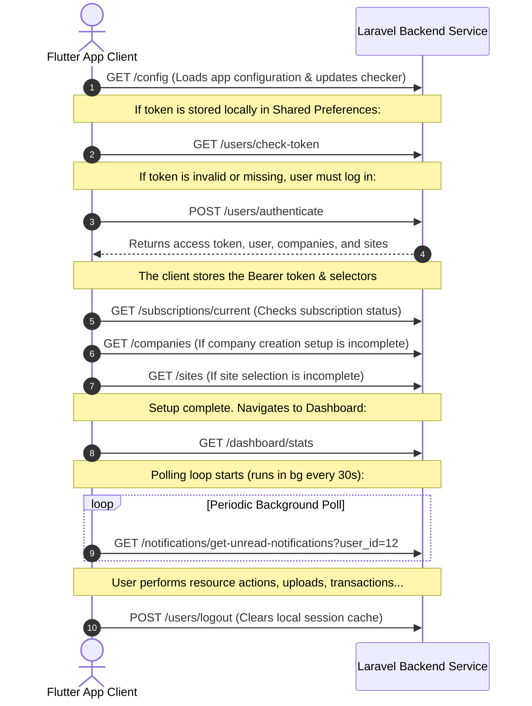

# Reconsmi Mobile App: Backend API Specification

This document provides a comprehensive specification of the REST API endpoints consumed by the Reconsmi Flutter mobile application. It is designed to guide the development of a compatible backend service (such as a Laravel application).

---

## 1. Global Setup & Network Layer

### Base URLs
*   **API Base URL**: `https://reconsmi.com/api`
*   **Storage Base URL**: `https://reconsmi.com/storage` (Used for retrieving stored static files, user profile pictures, and site media)

### Request Headers
Every request made by the mobile application contains a set of standard headers. Depending on the request type (public vs. authenticated) and the user session state (company and site context), extra headers are dynamically appended by the app's interceptor.

| Header Name | Type | Description | Required |
| :--- | :--- | :--- | :--- |
| `Content-Type` | String | Must be `application/json` (except for multipart/form-data uploads) | Yes |
| `Accept` | String | Must be `application/json` | Yes |
| `X-Requested-With` | String | Must be `XMLHttpRequest` (identifies AJAX request to Laravel) | Yes |
| `Authorization` | String | `Bearer <token>` (the access token received upon login/registration) | Yes (when authenticated) |
| `company-id` | Integer | ID of the currently selected/active company | Yes (when logged in & company is active) |
| `site-id` | Integer | ID of the currently selected/active site | Yes (when logged in & site is active) |
| `user-id` | Integer | ID of the currently logged-in user | Yes (when authenticated) |
| `X-App-Version` | String | Hardcoded version identifier used specifically on `/config` requests (e.g., `1.0.2.11`) | Yes (specifically for `/config`) |

---

## 2. Response & Error Handling

### Successful Responses
Most endpoints wrap responses in a success envelope:
```json
{
  "error": false,
  "message": "Retrieved successfully",
  "data": { ... } // Or an array [...]
}
```

If the API returns a raw JSON array, the app's client helper will wrap it locally inside a `data` field:
```json
{
  "data": [ ... ],
  "rows": [ ... ]
}
```

### Error Responses
The backend should return appropriate HTTP status codes (400, 401, 403, 404, 422, 500) and format errors in a JSON envelope:
```json
{
  "message": "Detailed error message goes here",
  "error": "Short error code or description"
}
```
*Note: If the application receives an HTTP `401 Unauthorized` response, it will automatically clear local storage data (access tokens, company IDs, site IDs) and redirect the user to the Login page.*

---

## 3. API Directory & Endpoints

### 3.1 Bootstrap & Public Core Configuration
Before the user logs in, or upon application launch, the app fetches config lists and checks token validity.

#### **Get Configuration**
*   **Method**: `GET`
*   **URL**: `/config`
*   **Headers**:
    ```http
    X-App-Version: 1.0.2.11
    Accept: application/json
    X-Requested-With: XMLHttpRequest
    ```
*   **Payload**: None
*   **Expected Response (`data` field contains a Config model)**:
    ```json
    {
      "success": true,
      "data": {
        "currency": {
          "code": "KES",
          "symbol": "KSh",
          "full_form": "Kenyan Shilling"
        },
        "mobile_app_version": {
          "current_version": "1.0.2",
          "minimum_supported_version": "1.0.0",
          "update_required": false
        },
        "purchase_order_priorities": [
          { "id": 1, "name": "Low", "color": "#00FF00" },
          { "id": 2, "name": "Medium", "color": "#FFA500" },
          { "id": 3, "name": "High", "color": "#FF0000" }
        ],
        "machine_types": [
          { "key": "excavator", "value": "Excavator" },
          { "key": "loader", "value": "Wheel Loader" }
        ],
        "machine_conditions": [
          { "key": "excellent", "value": "Excellent" },
          { "key": "fair", "value": "Fair" },
          { "key": "poor", "value": "Poor" }
        ],
        "license_types": [
          { "key": "permit", "value": "Operating Permit" }
        ],
        "wallet_transaction_types": [
          { "key": "deposit", "value": "Deposit" },
          { "key": "payment", "value": "Payment" }
        ],
        "activity_log_types": [
          { "key": "auth", "value": "Authentication" }
        ]
      }
    }
    ```

#### **Token Validation**
*   **Method**: `GET`
*   **URL**: `/users/check-token`
*   **Headers**: Authenticated Headers
*   **Payload**: None
*   **Expected Response**:
    ```json
    {
      "success": true,
      "data": {
        "id": 12,
        "first_name": "John",
        "last_name": "Doe",
        "email": "johndoe@example.com",
        "phone": "+254700000000",
        "photo": "profiles/john.jpg",
        "role": "admin",
        "status": true
      }
    }
    ```

---

### 3.2 User Lifecycle (Authentication & Onboarding)

#### **Login / Authenticate**
*   **Method**: `POST`
*   **URL**: `/users/authenticate`
*   **Payload**:
    ```json
    {
      "email": "johndoe@example.com",
      "password": "SecretPassword123"
    }
    ```
*   **Expected Response**:
    ```json
    {
      "error": false,
      "access_token": "eyJ0eXAiOiJKV1QiLCJhbGciOi...",
      "user": {
        "id": 12,
        "first_name": "John",
        "last_name": "Doe",
        "email": "johndoe@example.com",
        "phone": "+254700000000",
        "photo": "profiles/john.jpg",
        "role": "admin",
        "status": true
      },
      "companies": [
        {
          "id": 1,
          "title": "Buildcorp Enterprises",
          "is_primary": true
        }
      ],
      "sites": [
        {
          "id": 5,
          "title": "Mombasa Road Project Site",
          "company_id": 1,
          "is_primary": true
        }
      ],
      "subscriptions": [
        {
          "id": 4,
          "status": "active"
        }
      ]
    }
    ```

#### **User Registration**
*   **Method**: `POST`
*   **URL**: `/users/register`
*   **Payload**:
    ```json
    {
      "first_name": "Jane",
      "last_name": "Doe",
      "email": "janedoe@example.com",
      "password": "Password123",
      "password_confirmation": "Password123",
      "phone": "+254711111111"
    }
    ```
*   **Expected Response**:
    ```json
    {
      "error": false,
      "message": "User registered successfully",
      "access_token": "eyJ0eXAiOiJKV1QiLCJhbGciOi...",
      "user": {
        "id": 13,
        "first_name": "Jane",
        "last_name": "Doe",
        "email": "janedoe@example.com",
        "phone": "+254711111111",
        "role": "user"
      }
    }
    ```

#### **Forgot Password**
*   **Method**: `POST`
*   **URL**: `/users/forgot-password`
*   **Payload**:
    ```json
    {
      "email": "johndoe@example.com"
    }
    ```
*   **Expected Response**:
    ```json
    {
      "error": false,
      "message": "Reset password instructions sent to your email."
    }
    ```

#### **Logout**
*   **Method**: `POST`
*   **URL**: `/users/logout`
*   **Headers**: Authenticated Headers
*   **Payload**: None
*   **Expected Response**:
    ```json
    {
      "success": true,
      "message": "Logged out successfully"
    }
    ```

#### **Delete Account**
*   **Method**: `DELETE`
*   **URL**: `/account/delete`
*   **Headers**: Authenticated Headers
*   **Payload**: None
*   **Expected Response**:
    ```json
    {
      "error": false,
      "message": "Your account has been successfully deleted."
    }
    ```

---

### 3.3 Company & Site Operations

#### **Get Companies List**
*   **Method**: `GET`
*   **URL**: `/companies`
*   **Query Parameters (Optional)**: Search filters (e.g. `search=Build`)
*   **Expected Response**:
    ```json
    {
      "error": false,
      "data": [
        {
          "id": 1,
          "title": "Buildcorp Enterprises",
          "description": "General contractor",
          "address": "Nairobi, Kenya",
          "phone": "+254722000000",
          "email": "info@buildcorp.co.ke",
          "website": "https://buildcorp.co.ke",
          "is_primary": true,
          "created_at": "2026-03-01T12:00:00.000Z"
        }
      ]
    }
    ```

#### **Get Specific Company Detail**
*   **Method**: `GET`
*   **URL**: `/companies/<id>`

#### **Create Company**
*   **Method**: `POST`
*   **URL**: `/companies`
*   **Payload**:
    ```json
    {
      "title": "New Construction Co.",
      "description": "Civil engineering works",
      "address": "Westlands, Nairobi",
      "phone": "+254733000000",
      "email": "contact@newco.com",
      "website": "https://newco.com"
    }
    ```

#### **Update Company**
*   **Method**: `PUT`
*   **URL**: `/companies/<id>`
*   **Payload**: Same schema as Create Company

#### **Delete Company**
*   **Method**: `DELETE`
*   **URL**: `/companies/<id>`

#### **Get Sites List**
*   **Method**: `GET`
*   **URL**: `/sites`
*   **Query Parameters (Optional)**: Filters (e.g., `company_id=1`)
*   **Expected Response**:
    ```json
    {
      "error": false,
      "data": [
        {
          "id": 5,
          "title": "Mombasa Road Project Site",
          "description": "Highway dual carriage paving",
          "status_id": 1,
          "status": "active",
          "priority_id": 3,
          "priority": "high",
          "start_date": "2026-03-01",
          "end_date": "2026-12-31",
          "budget": 50000000.0,
          "task_accessibility": "all",
          "is_favorite": true,
          "is_primary": true,
          "company_id": 1
        }
      ]
    }
    ```

---

### 3.4 Subscription Management

#### **Get Subscription Plans**
*   **Method**: `GET`
*   **URL**: `/subscriptions/plans`
*   **Expected Response**:
    ```json
    {
      "error": false,
      "data": [
        {
          "id": 1,
          "name": "Standard Plan",
          "price": 5000,
          "billing_period": "monthly",
          "description": "For mid-size projects"
        }
      ]
    }
    ```

#### **Get Current Subscription Status**
*   **Method**: `GET`
*   **URL**: `/subscriptions/current`
*   **Expected Response**:
    ```json
    {
      "error": false,
      "data": {
        "id": 4,
        "plan_id": 1,
        "status": "active", // Possible values: active, trialing, pending, processing, canceled
        "starts_at": "2026-06-01T00:00:00.000Z",
        "ends_at": "2026-07-01T00:00:00.000Z"
      }
    }
    ```

#### **Subscribe to Plan**
*   **Method**: `POST`
*   **URL**: `/subscriptions/subscribe`
*   **Payload**:
    ```json
    {
      "plan_id": 1,
      "phone": "+254700000000",
      "payment_method": "mpesa"
    }
    ```

#### **Cancel Subscription**
*   **Method**: `POST`
*   **URL**: `/subscriptions/cancel`

---

### 3.5 Profile & Account Configurations

#### **Get Profile Details**
*   **Method**: `GET`
*   **URL**: `/profile`

#### **Update User Profile (Profile Extension)**
*   **Method**: `PUT`
*   **URL**: `/profile`
*   **Payload**:
    ```json
    {
      "first_name": "John",
      "last_name": "Doe",
      "phone": "+254700000000"
    }
    ```

#### **Alternative Update Profile (Master Panel)**
*   **Method**: `PUT`
*   **URL**: `/master-panel/account/<user_id>`
*   **Payload**: Same as above

#### **Update Profile Picture (Multipart Upload)**
*   **Method**: `POST`
*   **URL**: `/profile/picture`
*   **Payload**:
    *   File field: `profile_image` (contains the profile image binary)

#### **Alternative Photo Update (Master Panel)**
*   **Method**: `POST`
*   **URL**: `/master-panel/account/<user_id>`
*   **Payload**:
    *   File field: `upload`
    *   Form field: `_method` = `PUT`

#### **Change Password**
*   **Method**: `POST`
*   **URL**: `/profile/change-password`
*   **Payload**:
    ```json
    {
      "current_password": "CurrentPassword123",
      "new_password": "NewSecretPassword456",
      "new_password_confirmation": "NewSecretPassword456"
    }
    ```

---

### 3.6 Dashboard Summary Stats

#### **Get Dashboard Statistics**
*   **Method**: `GET`
*   **URL**: `/dashboard/stats`
*   **Headers**: Authenticated + `company-id` + `site-id`
*   **Expected Response**:
    ```json
    {
      "error": false,
      "data": {
        "wallet_balance": 150000.0,
        "total_workers": 25,
        "active_visitors": 4,
        "pending_purchase_orders": 3,
        "low_stock_items_count": 2
      }
    }
    ```

---

### 3.7 Inventory Control & Movements

#### **Get Inventory Items**
*   **Method**: `GET`
*   **URL**: `/inventory-items`
*   **Query Parameters (Optional)**: Filters (e.g. `search=cement`)
*   **Expected Response**: List of inventory items containing SKU, quantities, and categories.

#### **Create Inventory Item**
*   **Method**: `POST`
*   **URL**: `/inventory-items`
*   **Payload**:
    ```json
    {
      "name": "Portland Cement Grade 42.5",
      "category_id": 2,
      "sku": "CMT-425",
      "quantity": 100,
      "unit": "bags",
      "min_stock": 10
    }
    ```

#### **Update Inventory Item**
*   **Method**: `PUT`
*   **URL**: `/inventory-items/<id>`
*   **Payload**: Same schema as Create Inventory Item

#### **Delete Inventory Item**
*   **Method**: `DELETE`
*   **URL**: `/inventory-items/<id>`

#### **Add Stock (Increase stock level)**
*   **Method**: `POST`
*   **URL**: `/inventory-items/<item_id>/add-stock`
*   **Payload**:
    ```json
    {
      "quantity": 50,
      "cost": 850.0,
      "notes": "Direct purchase from supplier"
    }
    ```

#### **Remove Stock (Disburse stock/reduce level)**
*   **Method**: `POST`
*   **URL**: `/inventory-items/<item_id>/remove-stock`
*   **Payload**:
    ```json
    {
      "quantity": 10,
      "notes": "Used for foundation casting"
    }
    ```

#### **Get Stock Movements**
*   **Method**: `GET`
*   **URL**: `/inventory-items/<item_id>/stock-movements`
*   **Expected Response**: List of stock increases/decreases, timestamps, and notes.

#### **Transfer Stock (Move stock between items)**
*   **Method**: `POST`
*   **URL**: `/inventory-items/transfer-stock`
*   **Payload**:
    ```json
    {
      "from_item_id": 1,
      "to_item_id": 2,
      "quantity": 5,
      "notes": "Category consolidation transfer"
    }
    ```

#### **Inventory Categories CRUD**
*   `GET` `/inventory-categories` - Get category list
*   `GET` `/inventory-categories/<id>` - Get category detail
*   `POST` `/inventory-categories` - Create category (Payload: `{ "name": "Category Name", "description": "Details" }`)
*   `PUT` `/inventory-categories/<id>` - Update category
*   `DELETE` `/inventory-categories/<id>` - Delete category

---

### 3.8 Machine / Fleet & License Management

#### **Machines CRUD**
*   `GET` `/machines` - Get list of equipment/fleet
*   `GET` `/machines/<id>` - Get details of machine
*   `POST` `/machines` - Create new machine. Payload:
    ```json
    {
      "name": "Caterpillar 320D Excavator",
      "model": "320D",
      "registration_number": "KBH 123X",
      "condition_key": "excellent",
      "type_key": "excavator"
    }
    ```
*   `PUT` `/machines/<id>` - Update machine details
*   `DELETE` `/machines/<id>` - Delete machine

#### **Licenses CRUD**
*   `GET` `/licenses` - Get list of operating/site licenses
*   `GET` `/licenses/<id>` - Get license details
*   `POST` `/licenses` - Create license. Payload:
    ```json
    {
      "name": "NEMA Environmental Permit",
      "license_type": "permit",
      "license_number": "NEMA-2026-X4",
      "expiry_date": "2026-12-31"
    }
    ```
*   `PUT` `/licenses/<id>` - Update license details
*   `DELETE` `/licenses/<id>` - Delete license

#### **Upload License File Document**
*   **Method**: `POST` (Multipart file upload)
*   **URL**: `/licenses/<id>/upload-file`
*   **Payload**:
    *   File field: `document_path` (contains PDF or image of license)

#### **Remove License Document**
*   **Method**: `DELETE`
*   **URL**: `/licenses/<id>/remove-file`

---

### 3.9 Wallet Payments & M-Pesa Integration

#### **Get Wallets**
*   **Method**: `GET`
*   **URL**: `/wallets`
*   **Expected Response**: List of wallets containing balances, status, and active status keys.

#### **Wallet Deposit (Add Funds)**
*   **Method**: `POST`
*   **URL**: `/wallets/<wallet_id>/add-funds`
*   **Payload**:
    ```json
    {
      "amount": 10000.0,
      "payment_method": "mpesa",
      "phone": "+254700000000"
    }
    ```

#### **Outbound M-Pesa Payment**
*   **Method**: `POST`
*   **URL**: `/wallets/<wallet_id>/mpesa-payment`
*   **Payload**:
    ```json
    {
      "phone": "+254722000000",
      "amount": 2500.0,
      "remarks": "Worker allowance payment"
    }
    ```

#### **Till Payment**
*   **Method**: `POST`
*   **URL**: `/wallets/<wallet_id>/till-payment`
*   **Payload**:
    ```json
    {
      "till_number": "123456",
      "amount": 5400.0,
      "remarks": "Hardware tools purchase"
    }
    ```

#### **Paybill Payment**
*   **Method**: `POST`
*   **URL**: `/wallets/<wallet_id>/paybill-payment`
*   **Payload**:
    ```json
    {
      "paybill_number": "247247",
      "account_number": "ACC-9988",
      "amount": 8000.0,
      "remarks": "Materials payment"
    }
    ```

#### **Pochi La Biashara Payment**
*   **Method**: `POST`
*   **URL**: `/wallets/<wallet_id>/pochi-payment`
*   **Payload**:
    ```json
    {
      "phone": "+254722999999",
      "amount": 1500.0,
      "remarks": "Vendor payment"
    }
    ```

#### **Phone Number Direct Payment**
*   **Method**: `POST`
*   **URL**: `/wallets/<wallet_id>/phone-payment`
*   **Payload**: Same as M-Pesa payment payload

#### **Check M-Pesa Payment Status**
*   **Method**: `GET`
*   **URL**: `/wallets/transactions/<transaction_id>/mpesa-status`
*   **Expected Response**: Transaction details indicating if status is completed, processing, or failed.

#### **Get Wallet Transactions**
*   **Method**: `GET`
*   **URL**: `/wallets/<id>/transactions`

---

### 3.10 Purchase Orders & Suppliers

#### **Get Purchase Orders**
*   **Method**: `GET`
*   **URL**: `/purchase-orders`
*   **Expected Response**: List of purchase orders, order numbers, totals, status and priority.

#### **Create Purchase Order**
*   **Method**: `POST`
*   **URL**: `/purchase-orders`
*   **Payload**:
    ```json
    {
      "supplier_id": 3,
      "site_id": 5,
      "priority": "high",
      "notes": "Urgent structural reinforcing bars",
      "items": [
        {
          "inventory_item_id": 14,
          "quantity": 100,
          "price": 1250.0
        }
      ]
    }
    ```

#### **Approve Purchase Order**
*   **Method**: `POST`
*   **URL**: `/purchase-orders/<id>/approve`
*   **Payload**: Empty JSON `{}` (or optional review remarks)

#### **Mark Purchase Order as Delivered**
*   **Method**: `POST`
*   **URL**: `/purchase-orders/<id>/mark-as-delivered`
*   **Payload**:
    ```json
    {
      "delivery_date": "2026-06-19",
      "delivery_notes": "Received in good condition"
    }
    ```

#### **Reject Purchase Order**
*   **Method**: `POST`
*   **URL**: `/purchase-orders/<id>/reject`
*   **Payload**:
    ```json
    {
      "reason": "Price discrepancy on item list"
    }
    ```

#### **Suppliers CRUD**
*   `GET` `/suppliers` - List suppliers
*   `GET` `/suppliers/<id>` - Supplier details
*   `POST` `/suppliers` - Create supplier (Payload: name, phone, email, address)
*   `PUT` `/suppliers/<id>` - Update supplier
*   `DELETE` `/suppliers/<id>` - Delete supplier

---

### 3.11 Visitor Management

#### **Get Visitors**
*   **Method**: `GET`
*   **URL**: `/visitors`

#### **Register Visitor Entry**
*   **Method**: `POST`
*   **URL**: `/visitors`
*   **Payload**:
    ```json
    {
      "name": "Alice Johnson",
      "company": "KRA Inspectorate",
      "host": "Site Manager",
      "phone": "+254755123456",
      "category_id": 2,
      "purpose": "Routine Tax audit inspection",
      "temperature": "36.5"
    }
    ```

#### **Checkout Visitor**
*   **Method**: `POST`
*   **URL**: `/visitors/<id>/check-out`

#### **Generate QR Code for Visitor**
*   **Method**: `POST`
*   **URL**: `/visitors/<id>/generate-qr-code`

#### **Visitor Categories CRUD**
*   `GET` `/visitor-categories` - List categories
*   `POST` `/visitor-categories` - Create visitor category
*   `PUT` `/visitor-categories/<id>` - Update visitor category
*   `DELETE` `/visitor-categories/<id>` - Delete visitor category

---

### 3.12 Material Deliveries

#### **Get Material Deliveries**
*   **Method**: `GET`
*   **URL**: `/material-deliveries`

#### **Create Material Delivery Record**
*   **Method**: `POST`
*   **URL**: `/material-deliveries`
*   **Payload**:
    ```json
    {
      "delivery_number": "DEL-9988",
      "supplier_id": 3,
      "delivery_date": "2026-06-19",
      "items": [
        {
          "name": "Crushed Ballast",
          "quantity": 18.5,
          "unit": "tonnes"
        }
      ],
      "received_by": "Jane Doe",
      "notes": "Offloaded at zone 4"
    }
    ```

---

### 3.13 Site Media & File Uploads

#### **Get Site Media**
*   **Method**: `GET`
*   **URL**: `/sites/<site_id>/media`
*   **Query Parameters**: `isApi=1`
*   **Expected Response**: List of media items (photos, drawings, site walkthrough video files)

#### **Upload Multiple Site Media Files**
*   **Method**: `POST` (Multipart file upload)
*   **URL**: `/sites/<site_id>/upload-media`
*   **Payload**:
    *   Form fields:
        *   `id`: `<site_id>`
        *   `title`: "Site Foundation Work" (Optional)
        *   `notes`: "Casting complete, ready for inspection" (Optional)
    *   Files:
        *   `media_files[]`: Contains one or more files in an array input block

#### **Update Site Media Metadata**
*   **Method**: `POST`
*   **URL**: `/sites/update-media`
*   **Payload**:
    ```json
    {
      "media_id": "14",
      "title": "Updated Media Title",
      "notes": "Updated Media description notes"
    }
    ```

#### **Delete Site Media**
*   **Method**: `DELETE`
*   **URL**: `/sites/media/<media_id>`

---

### 3.14 Workers, Salaries & Payroll Period

#### **Workers CRUD**
*   `GET` `/workers/list` - Get company workers list
*   `GET` `/workers/<id>` - Get worker detail info
*   `POST` `/workers` - Add new worker. Payload:
    ```json
    {
      "name": "Samuel Okoth",
      "email": "samuel@example.com",
      "phone": "+254712000222",
      "hourly_rate": 350.0,
      "role": "Mason"
    }
    ```
*   `PUT` `/workers/<id>` - Update worker details
*   `DELETE` `/workers/<id>` - Delete worker

#### **Payroll Periods CRUD**
*   `GET` `/payroll-period` - Get periods list
*   `GET` `/payroll-period/<id>` - Period detail
*   `POST` `/payroll-period` - Create period (start_date, end_date, name)
*   `PUT` `/payroll-period/<id>` - Update period
*   `DELETE` `/payroll-period/<id>` - Delete period

#### **Salary Components CRUD**
*   `GET` `/salary-component` - Get salary details
*   `GET` `/salary-component/<id>` - Detail component
*   `POST` `/salary-component` - Create salary component (name, amount, type, calculation_type)
*   `PUT` `/salary-component/<id>` - Update component
*   `DELETE` `/salary-component/<id>` - Delete component

---

### 3.15 Background In-App Notifications & Polling
The application runs a periodic background task (polling every 30 seconds) to check for updates.

#### **Get Unread Notifications Count & Data**
*   **Method**: `GET`
*   **URL**: `/notifications/get-unread-notifications`
*   **Query Parameters**: `user_id=<user_id>`
*   **Expected Response**:
    ```json
    {
      "count": 1,
      "data": [
        {
          "id": 412,
          "title": "Low Stock Warning",
          "message": "Cement stock level is below minimum limit.",
          "type": "inventory_warning"
        }
      ]
    }
    ```

#### **Mark All Notifications as Read**
*   **Method**: `POST`
*   **URL**: `/notifications/mark-all-as-read`

#### **Mark Single Notification Status (Mark Read)**
*   **Method**: `POST`
*   **URL**: `/notifications/update-status`
*   **Payload**:
    ```json
    {
      "id": 412,
      "needConfirm": false
    }
    ```

#### **Get Activity Logs**
*   **Method**: `GET`
*   **URL**: `/activity-logs`

---

## 4. Typical Application Lifecycle & Flow

When creating your backend service, ensure your routing layer supports this linear workflow of the client:


